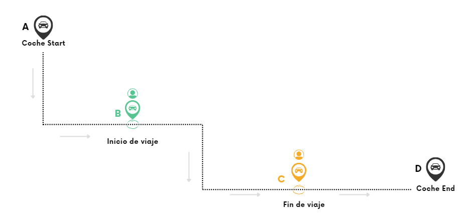
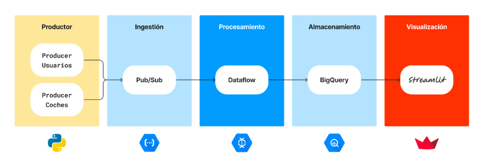
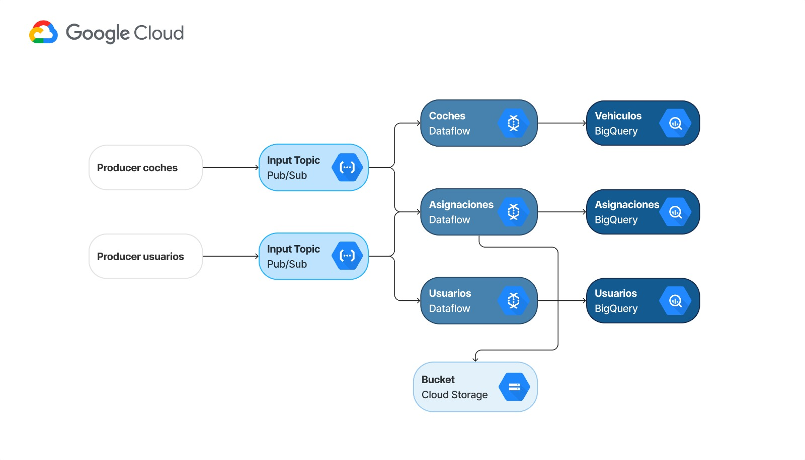
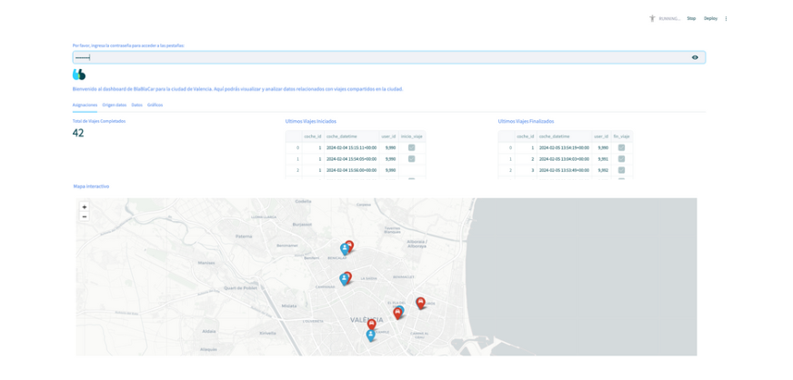

# ValenStream: Real-Time shared travel platform in Valencia

## Introducción

Este es el repositorio relativo al 2 Data Project del Máster de Data Analytics de la promoción 2023-24. El grupo está compuesto por Jackeline Romero, Adriana Campos, Cristian Marty, Jesús Jornet y Mar Pons.

## Caso Expuesto

La compañía BlaBlaCar ha tomado la decisión de implementar una plataforma dedicada a los viajes compartidos en la ciudad de Valencia. Este proyecto implica la creación y puesta en marcha de un sistema que permitirá a los usuarios compartir trayectos de manera eficiente y colaborativa en esta área específica. La iniciativa tiene como objetivo facilitar la movilidad de las personas al proporcionar una solución de transporte compartido en Valencia.

## Solución

La herramienta propuesta consta de un sistema de asignación de viajes que conecta usuarios con coches en tiempo real. Los usuarios determinan una ubicación de origen y una de destino, mientras que los coches declaran su ruta o trayecto. La herramienta conecta a ambos si existe una coincidencia entre la ruta declarada de los automovilistas y el origen y destino introducidos por los usuarios. Todos los viajes son registrados en una base de datos, sobre la cual montamos un dashboard que visualiza datos en streaming.

## Stack Tecnológico

Hemos utilizado las siguientes tecnologías para desarrollar y poner en marcha nuestra solución:

- **Pub/Sub:** Utilizado para la gestión de mensajes en tiempo real, permitiendo la comunicación entre los distintos componentes de nuestra aplicación de manera eficiente y escalable.
- **Dataflow:** Empleado para el procesamiento de datos en tiempo real, permitiendo el análisis y la transformación de los datos de manera continua y en grandes volúmenes.
- **Streamlit:** Utilizado para la creación de una interfaz de usuario interactiva y dinámica, que permite a los usuarios visualizar y explorar los datos de manera intuitiva.
- **BigQuery:** Empleado como base de datos para almacenar y consultar los datos generados por nuestra aplicación, permitiendo un análisis rápido y escalable de grandes conjuntos de datos. 

## Arquitectura Cloud

## Modelo Relacional

## Dashboard

## Vídeos

---[Loom Proyecto Blablacar](https://drive.google.com/file/d/1hVokuxiNwS3bkqmrpsQcICymLkjE-EI2/view?usp=sharing)

---[Video Dashboard](https://drive.google.com/file/d/1xSlbGHDRIeU5MVcBE5jggkz-3SBLmxLF/view?usp=sharing)

